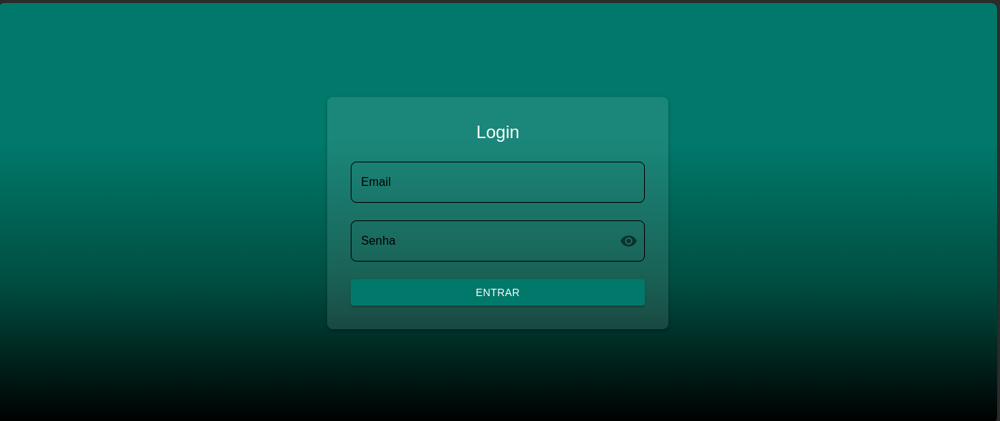
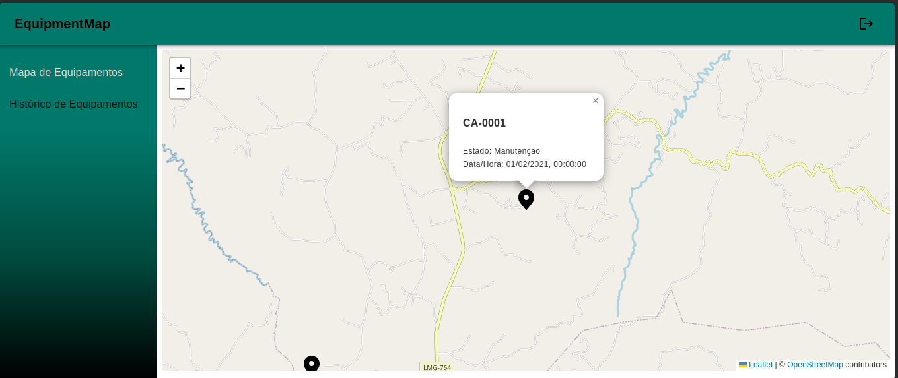
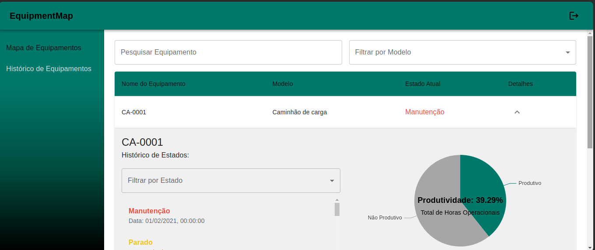

# Teste técnico para desenvolvedor(a) frond-end

Este projeto é uma aplicação web para monitoramento de equipamentos em operações florestais. A aplicação exibe dados de posições e estados dos equipamentos, coletados via GPS e atualizados periodicamente. Ela permite visualizar as localizações dos equipamentos em um mapa e acompanhar seu histórico de estados (Operando, Parado, ou em Manutenção). A interface é projetada para fornecer uma visão clara e acessível dos dados para os gestores da operação.

## Tecnologias Utilizadas

- React: Biblioteca JavaScript para construção de interfaces de usuário.
- TypeScript: Superset de JavaScript que adiciona tipos estáticos, proporcionando maior segurança e robustez ao código.
- MUI React: Biblioteca de componentes React para uma interface consistente e moderna.
- Leaflet: Biblioteca para exibição de mapas interativos e visualização de dados geoespaciais.
- ECharts: Biblioteca para criação de gráficos e dashboards interativos.
- Axios: Cliente HTTP para chamadas à API.
- Context: Mecanismo de gerenciamento de estado global no React.
- Vite: Ferramenta de build rápida para desenvolvimento eficiente com React.

## Instalação e Configuração

1 - Abra o vs code

2 - No canto esquerdo superior clique em Terminal

Em seguida, no terminal digite:

3 - Clone o repositório com o comando
git clone https://github.com/nicklopesc/teste-nicole-lopes.git

4 - Navegue até o diretório do projeto com:
cd teste-nicole-lopes

5 - Instale as dependências executando:
npm install

6 - Execute o projeto com:
npm run dev

7 - Abra o projeto no navegador

## Acesso ao login

\*O Login pode ser feito com qualquer email ou senha.
Exemplo:

email : email@email.com

Senha: password

## Funcionalidades

- Mapa de Equipamentos: Exibe a localização atual de todos os equipamentos em um mapa interativo, mostrando detalhes como status e data/hora da última atualização.

- Histórico de Equipamentos: Apresenta uma tabela com os equipamentos, permitindo filtragem por nome e modelo. Ao expandir um equipamento na tabela, você acessa informações detalhadas, como status e data/hora. Inclui também filtros por status e um gráfico que exibe a porcentagem de produtividade com base no total de horas operadas.

## Estrutura do Projeto:

- - **`src/`**: Código-fonte da aplicação.
    <!-- - **`components/`**: Contém componentes reutilizáveis em toda a aplicação. -->
    - **`layout/`**: Contém o layout principal da aplicação.
  - **`pages/`**: Páginas principais da aplicação.
  - **`modules/components/`**: Componentes específicos para páginas principais.
  - **`context/`**: Gerencia o estado da aplicação.

## Gerenciamento de Roteamento

A aplicação utiliza uma camada de roteamento para gerenciar a navegação entre diferentes páginas sem recarregar a página inteira. Isso é fundamental em uma SPA (Single Page Application) e oferece várias vantagens:

- **Centralização da Lógica de Roteamento**: Todos os caminhos e componentes relacionados às rotas são mantidos em um único local, facilitando a manutenção e a escalabilidade da aplicação.
- **Otimização do Desempenho**: Carregamento sob demanda dos componentes reduz o tempo de carregamento inicial e melhora a experiência do usuário.
- **Facilidade de Manutenção**: Simplifica a gestão das rotas e torna mais fácil a atualização e manutenção da aplicação à medida que ela cresce.

A aplicação é centrada em dois componentes principais que são essenciais para a sua funcionalidade.

### Map

**Descrição**: Componente para exibição das posições atuais dos equipamentos em um mapa interativo.

**Tecnologias**: React, Leaflet, MUI

**Principais Funcionalidades**:

- **Visualização de Equipamentos**: Utiliza o `MapContainer` do Leaflet para exibir um mapa com os equipamentos marcados.
- **Ícone Personalizado**: Exibe ícones personalizados para cada equipamento usando `L.icon`.
- **Popup de Equipamento**: Ao clicar em um marcador, um popup mostra o nome do equipamento, seu estado atual e a data/hora da última posição.

**Funções**:

- `getEquipmentState(equipmentId: string, date: string)`: Retorna o estado do equipamento na data fornecida.
- `getLatestPosition(equipmentId: string)`: Retorna a última posição conhecida do equipamento.

---

### HistoricEquipament

**Descrição**: Componente para exibição e filtragem de equipamentos em uma tabela com detalhes e histórico.

**Tecnologias**: React, MUI

**Principais Funcionalidades**:

- **Pesquisa e Filtros**: Permite pesquisar por nome do equipamento e filtrar por modelo.
- **Tabela de Equipamentos**: Exibe uma tabela com colunas para nome, modelo, estado atual e uma opção para expandir os detalhes do equipamento.
- **Detalhes Expandidos**: Mostra detalhes adicionais sobre o equipamento, incluindo um gráfico de produtividade, quando uma linha da tabela é expandida.
- **Paginação**: Permite navegar por páginas de resultados com controle de número de linhas por página.

**Funções**:

- `handleSearch(event: React.ChangeEvent<HTMLInputElement>)`: Atualiza o search de pesquisa.
- `handleFilterModel(event: SelectChangeEvent<string>)`: Atualiza o filtro por modelo.
- `handleChangePage(event: React.MouseEvent<HTMLButtonElement> | null, newPage: number)`: Altera a página de resultados.
- `handleChangeRowsPerPage(event: React.ChangeEvent<HTMLInputElement>)`: Altera o número de linhas por página.
- `calculateProductivity(equipmentId: string)`: Calcula a porcentagem de produtividade com base no histórico de estados do equipamento.

## Imagens da aplicação

